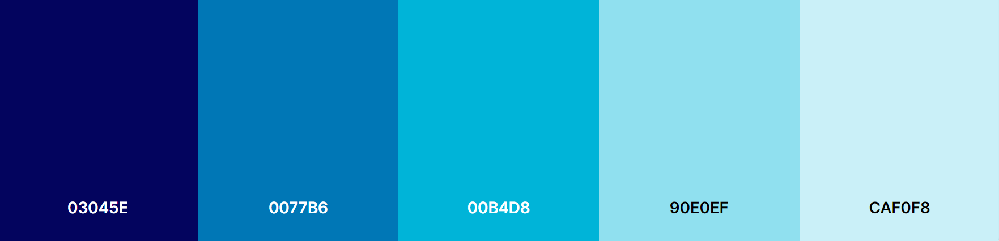

# DESK HQ

# Welcome to DESK HQ (Project 4)


[Desk HQ](https://desk-hq.herokuapp.com/) is a co-working space website, which offers the perfect destination for entrepreneurs, freelancers, and small businesses looking for a professional and collaborative work environment.


## CONTENTS

* [Overview](#overview)
  * [Project Goals](#project-goals)
* [User Experience](#user-experience)
  * [User Stories](#user-stories)

* [Design Structure](#design-structure)
  * [Colour Scheme](#colour-scheme)
  * [Typography](#typography)
  * [Images](#images)
  * [Visual Effects](#visual-effects)
  * [Wireframes](#wireframes)
  * [Database Schema & User Journey](#database-schema--user-journey)
    * [User Journey](#user-journey)
    * [First Draft Database Schema](#first-draft-database-schema)
    * [Final Database Schema](#final-database-schema)

* [Features](#features)
  * [Elements Fount on Each Page](#elements-found-on-each-page)
  * [Future Implementations](#future-implementations)
  * [Accessibility](#accessibility)
------

## Overview

###  Project Goals

This project is a concept which is aim at creating a co-working space community, where people can innovate and thrive. It is designed to foster creativity, productivity, and networking opportunities for like-minded individuals.

With provision of state-of-the-art facilities, people will have access to high-speed internet, ergonomic workstations, private meeting rooms, and modern amenities that cater for their needs. DESK HQ offer flexible options to fit any schedule and budget, from daily passes to monthly booking, so people can work on their terms.


Link to deployed site: [DESK HQ](https://desk-hq.herokuapp.com/)

## User Experience

### User Stories

#### __Target Audience__

DESK HQ is targeted at freelancer, startup, or established business, who like to collaborate, network on a platform to grow business and achieve their goals.

#### __Client Goals__ 

+ Create a program where the user can easily find information about the amenities and pricing of the space, so that I can make an informed decision about whether it is the right fit for me and my business.

+ Create a program that clearly list the available amenities such as high-speed internet, printing facilities, and meeting rooms, as well as the different booking options, such as daily passes, Training Rooms, private offices etc. 

+ Create a program that provide detailed information about the location of the space, including nearby transportation options and parking availability.

#### __First Time Visitor Goals__

As a first time user of the site I want to be able to:

+ Understand what the site is for and how to navigate the site.
+ Register for an account.
+ Quickly understand the benefits of co-working and how the space can help me grow my business, so that I am motivated to sign up.
+ Access the website from any device.
+ Contact somebody via the contact form or contact details for enquiry.
+ Receive feedback from my intaraction with the website

#### __Returning Visitor Goals__

As a returning user of the site I want to be able to:

+ Log in to my account.
+ Create, edit, delete and view my workspace booking.
+ Easily book a workspace.


#### __Frequent Visitor Goals__

As a frequent user of the site I want to be able to:

+ Easily access my account information and make changes to my bookings more efficiently.

#### __Admin User__

As an administrator for the site I want to be able to:

+ Manage or approve booking contents.

- - -

## Design Structure
***
This site was design with simplicity of colors and easy to navigate that allow for a good user experience.

All pages are clearly displayed with easy to read fonts. The pages are easily navigated with buttons.

### Colour Scheme

+ DESK HQ uses serene color palette, which is a color that can calming and reliable. The color palette was created using the [Coolors](https://coolors.co/palette/03045e-0077b6-00b4d8-90e0ef-caf0f8) website.

 

### Typography

Google Fonts was used to import the chosen fonts for use in the site.

+ Open sans is used for the body text on this site for user experience readability, with a secondary sans-serif font.
+ Lato is used for headings on the site for readability, simple and clean looking, with a secondary of serif font.
+ Merriweather Sans is used for hero text on the site for readability, legible and is a great choice for accessibility, with a secondary of Roboto.

### Images

The images used for this project were sourced from [freepik](https://www.freepik.com/free-photos-vectors/office-space)

### Visual Effects

#### Hover effect
The navbar links, brand name and buttons include a hover-over effect to make the experience more interactive and navigation more intuitive. When the user hovers over the link or button its colour, font-size or background colour changes.

#### Shadows
The shadows used on various cards and the navbar give them a raised effect, which makes them stand out from the white background. It is used to create an interesting effects and draw users attention.

### Onscroll Button
The onscroll button provides a better user experience as it allows users to easily navigate to the top of a page without having to manually scroll back up. Also, allows user to quickly move between different sections of the page.


### Wireframes

Wireframes original plan were created for mobile, tablet and desktop using Balsamiq. There are slight different from what was originally planned.

### __Home Page__

<details><summary>click to expand</summary>


</details>


### __About Us Page__

<details><summary>click to expand</summary>

</details>


### __Service Page__

<details><summary>click to expand</summary>


</details>


### __Sign Up Page__

<details><summary>click to expand</summary>

</details>


### __Login Page__

<details><summary>click to expand</summary>

</details>


### __Booking Form Page__

<details><summary>click to expand</summary>

</details>


[Back to the Top](#welcome-to-desk-hq-project-4)

---


```
pkill uptime.sh
rm .vscode/uptime.sh
```

**Anything more?**

Yes! We'd strongly encourage you to look at the source code of the `uptime.sh` file so that you know what it's doing. As future software developers, it will be great practice to see how these shell scripts work.

---

Happy coding!
