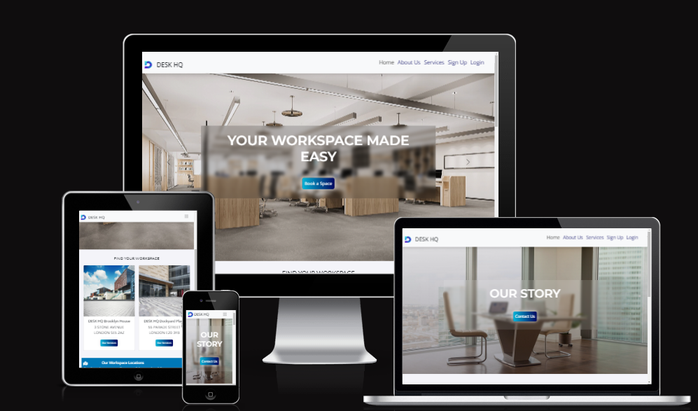
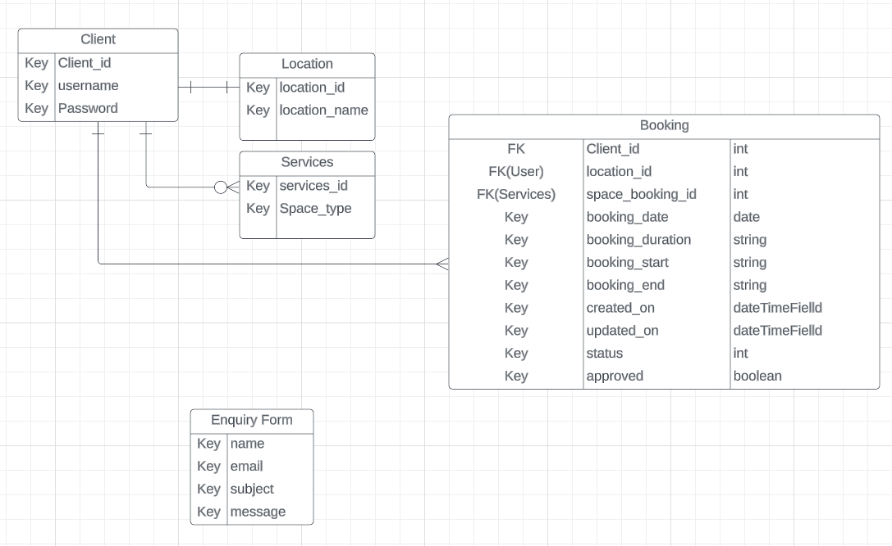

# DESK HQ

# Welcome to DESK HQ (Project 4)



[Desk HQ](https://desk-hq.herokuapp.com/) is a co-working space website, which offers the perfect destination for entrepreneurs, freelancers, and small businesses looking for a professional and collaborative work environment.


## CONTENTS

* [Overview](#overview)
  * [Project Goals](#project-goals)
* [User Experience](#user-experience)
  * [User Stories](#user-stories)

* [Design Structure](#design-structure)
  * [Colour Scheme](#colour-scheme)
  * [Typography](#typography)
  * [Images](#images)
  * [Visual Effects](#visual-effects)
  * [Wireframes](#wireframes)
  * [Development Plan](#development-plan)
  * [Database Schema](#database-schema)

* [Features](#features)
  * [Existing Features Across Page](#existing-features-across-page)
  * [Page Elements](#page-elements)
  * [Future Implementations](#future-implementations)
  * [Accessibility](#accessibility)

* [Testing](#testing)

* [Technologies Used](#technologies-used)
  * [Languages Used](#languages-used)
  * [Frameworks Used](#frameworks-used)
  * [Databases Used](#databases-used)
  * [Programs, Libraries & Packages Used](#Programs-libraries--packages-used)  
* [Error Handling](#error-handling)
* [Deployment](#deployment)
  * [Fork GitHub Repository](#fork-github-repository)
  * [Clone GitHub Repository](#clone-github-repository)
  
* [Credits](#credits)
  * [Code Used](#code-used)
  * [Media](#media)
  * [Content](#content)
  * [Acknowledgments](#acknowledgments)

- - -

## Overview

###  Project Goals

This project is a concept which is aim at creating a co-working space community, where people can innovate and thrive. It is designed to foster creativity, productivity, and networking opportunities for like-minded individuals.

With provision of state-of-the-art facilities, people will have access to high-speed internet, ergonomic workstations, private meeting rooms, and modern amenities that cater for their needs. DESK HQ offer flexible options to fit any schedule and budget, from daily passes to monthly booking, so people can work on their terms.


Link to deployed site: [DESK HQ](https://desk-hq.herokuapp.com/)

## User Experience

### User Stories

#### __Target Audience__

DESK HQ is targeted at freelancer, startup, or established business, who like to collaborate, network on a platform to grow business and achieve their goals.

#### __Client Goals__ 

+ Create a program where the user can easily find information about the amenities and pricing of the space, so that they can make an informed decision about whether it is the right fit for their business.

+ Create a program that clearly list the available amenities such as high-speed internet, printing facilities, and meeting rooms, as well as the different booking options, such as daily passes, Training Rooms, private offices etc. 

+ Create a program that provide detailed information about the location of the space, including nearby transportation options and parking availability.

#### __First Time Visitor Goals__

As a first time user of the site I want to be able to:

+ Access the website from any device.
+ Understand what the site is for and how to navigate the site.
+ Register for an account.
+ Quickly understand the benefits of co-working and how the space can help me grow my business, so that I am motivated to sign up.
+ Contact somebody via the contact form or contact details for enquiry.
+ Receive feedback from my interaction with the website
+ I want to learn more about the project on github.

#### __Returning Visitor Goals__

As a returning user of the site I want to be able to:

+ Log in to my account.
+ Create, edit, delete and view my workspace booking.
+ Easily book a workspace.


#### __Frequent Visitor Goals__

As a frequent user of the site I want to be able to:

+ Easily access my account information and make changes to my bookings more efficiently.

#### __Admin User__

As an administrator for the site I want to be able to:

+ Manage or approve booking contents.

- - -

## Design Structure
***
This site was design with simplicity of colors and easy to navigate that allow for a good user experience.

All pages are clearly displayed with easy to read fonts. The pages are easily navigated with buttons.

### Colour Scheme

+ DESK HQ uses serene color palette, which is a color that can calming and reliable. The color palette was created using the [Coolors](https://coolors.co/palette/03045e-0077b6-00b4d8-90e0ef-caf0f8) website.

 

### Typography

Google Fonts was used to import the chosen fonts for use in the site.

+ Open sans is used for the body text on this site for user experience readability, with a secondary sans-serif font.
+ Lato is used for headings on the site for readability, simple and clean looking, with a secondary of serif font.
+ Merriweather Sans is used for hero text on the site for readability, legible and is a great choice for accessibility, with a secondary of Roboto.

### Images

The images used for this project were sourced from [freepik](https://www.freepik.com/free-photos-vectors/office-space)

### Visual Effects

#### Hover effect
The navbar links, brand name and buttons include a hover-over effect to make the experience more interactive and navigation more intuitive. When the user hovers over the link or button its colour, font-size or background colour changes.

#### Shadows
The shadows used on various cards and the navbar give them a raised effect, which makes them stand out from the white background. It is used to create an interesting effects and draw users attention.

#### Onscroll Button
The onscroll button provides a better user experience as it allows users to easily navigate to the top of a page without having to manually scroll back up. Also, allows user to quickly move between different sections of the page.


### Wireframes

Wireframes original plan were created for mobile, tablet and desktop using Balsamiq. There are slight different from what was originally planned.

#### __Home Page__

<details><summary>click to expand</summary>


</details>


#### __About Us Page__

<details><summary>click to expand</summary>

</details>


#### __Service Page__

<details><summary>click to expand</summary>


</details>


#### __Sign Up Page__

<details><summary>click to expand</summary>

</details>


#### __Login Page__

<details><summary>click to expand</summary>

</details>


#### __Booking Form Page__

<details><summary>click to expand</summary>

</details>

## Development Plan

### Agile Methodology

The website was developed following an agile method, with the use of GitHub's projects to prioritise and track user stories. This approach allowed the  implementation of ideas based on the level of importance. The following categories were applied, and a corresponding labels were created on different issues:
- must have
- should have
- would have
- could have


One of the listed features has not been implemented due to time constrain. The completed user stories are in the "Done" section and the ones that were not prioritised for the first set of iteration are in the "Todo" section, to be completed in the next iteration. 


## Database Schema


The database schema was created using Lucidchart. The table creation uses Elephant SQL. 


[Back to the Top](#welcome-to-desk-hq-project-4)

---

## Features

The website is comprised of 10 pages which are extended from a base template.

* Home page
* About Us page
* Services page
* Login page
* Sign Up page
* Space Booking page
* Booking Details page
* Update booking page
* Delete Booking page
* Error page

### Existing Features Across Page
***

* Favicon - Created at [Favicon.io](https://favicon.io/). I have chosen a letter 'D'. The firest letter of DESK HQ, making it easier for users to identify and remember the website. The image has also been used as the logo for the site, which create an overall continuity through the site for users and promotes brand awareness.

  

* Navbar - The Navbar is displayed on all pages of the website and allows users to navigate the site with ease. The navbar is comprised of a logo, the sites name and links to navigate the site. The links on the navbar will vary depending on whether a user is logged into their account.

  * The navbar is a key feature of the website, located at the top of the page in a fixed position.
  * If the user is logged in, the username is displays on the toggle navbar. Additionally, the booking details bar is highlighted, which allows users to view their booking(s)
  * The navbar also includes several links that aid navigation on the website:
  * The "About Us" link provides information about the website and its purpose. 
  * The "Service" link provides the user with detailed information about different types of spaces for booking.
  * The "Login" and "Sign up" links are used for user authentication and are only visible to unauthenticated users. Once the user logs in, the links will not be visible, the "Log out" will be displayed instead.
  * The user must be logged in to access all the pages on the website.


  __User logged in Navbar__
  
  

  __User not logged in Navbar__

  

* Footer - A footer is displayed on all pages of the website and contains the copyright year which is updated to the current year with help of JavaScript.

  

- - -


+ ## Home Page

* The home page is the main entry point for users to explore and access the website's content. It provides users with an overview 
  of the website's purpose, content, and easy navigation. The home page consists of the following features: 

  * Hero images in a carousel with brief message text overlay, that introduces the user to the goal of the website. 

  * Call-to-Action (CTA) which includes buttons that link other part of the website. 

  * Images of DESK HQ office Locations and Addresses which includes buttons that link to the Services page. 

  * Map Toolkit and a description to the locations and a contact details for user to easily communicate. 

  * Contact Us Form. where user can contact us by sending messages for enquiry with any questions or concerns. The form includes 
    fields for the user's name, email address, subject for specifying the nature of the inquiry and message field.


## About Us Page 

* The about section introduces the user to the objectives and purpose of the website. 
  * The section made a brief description about DESK HQ. 
  * This section has a contact us clickable botton that takes user to the Contact Form on the Home page. 
  * The section introduces the user to the services offered by DESK HQ. 


## Services Page 

* The Services page includes images of type of service and description of each. 
  * This section provides the user with detailed information about different types of spaces for booking. 
  * The user can read and learn about the benefits and the type of spaces available. 
  * The user can learn about the booking options available including facilities and benefits. 


***

## Sign Up Page 

* The page where user is able to create an account.


## Login Page 

* The page where user can login into their account.


## Authentication 

* This project uses Django authentication system [django-allauth](https://docs.djangoproject.com/en/3.2/topics/auth/default/#) which provides both authentication and authorization. Both typically represent the people interacting with the site and are used to enable  restricting access to the contents. 

* Authentication is one of the core paths of this project [User Story #3]. As the booking details is only available only for authenticated users.

<details><summary>click to expand</summary>


</details>

## User Authentication 

* This project uses Django's built-in User model, which users use to sign up and log in to the website. The registration process requires user to enter their password twice to ensure that they have typed it correctly.  

* The login process requires user to use their email address / username as the primary identifier for user accounts.

## Space Booking Page 

* The Space Booking Page allow users to reserve and book various types of spaces for different purposes with the click of button at the bottom of the form. The spaces range from Meeting room, Conference room, Exclusive workstation, Day workstation and Co-working workstation. 

* The booking form features the location, date, duration, the start of the booking time slot and when the booking ends. 

* In addition, the Booking Page include a Notice information regarding cancellation policies and late arrival at the bottom of the booking form. 

* After the user has made their booking, user is redirected to the home page where a message is displayed at the top of the page informing the user of a successful booking.


## Booking Details Page 

* This page provides users with a detailed summary of their booking after they have completed the reservation process on the Space Booking Page.

* It displays important information about the booking reservation, including the booking location, the name of the space, date, duration, the start of the booking time slot and when the booking ends. 

* The page also consists of the Edit Booking and the Cancel Booking button for updating and deleting booking respectively on individual booking details.


## Update Booking Page 

* The Update Booking Page allows users to make changes to an existing booking they have previously made with the click of ‘update’ button at the bottom of the form. It requires the user to be logged in into their account to access their booking details. 

* The feature allows users to edit booking that was previously made. This feature is accessible from the Booking details view by clicking on an edit booking button. When the button is clicked, user is redirected to ‘booking_details/update’ page. 

* The page displays the current booking details, the user is then able to modify certain aspects of their booking reservation. 

* This page provides users with a convenient and flexible way to modify their booking details if their plans change. 

* After the user has made the desired changes to their booking, user is redirected to the booking details page, where a message is displayed at the top of the page informing the user of the booking updated successfully.


<details><summary>click to expand</summary>


</details>


## Delete Booking Page 

* The delete booking feature allows users to cancel booking that they have previously made.
* This feature is accessible from the Booking detail view by clicking on a delete button.
* When the button is clicked, a modal pop up with the question of ‘Are you sure you want to cancel this booking’ and a 'Yes’ or ‘No’ choices.
* The user is redirected to the page to confirm the deletion. 
* Once the user confirms the deletion, the booking will be removed from the booking details. This feature is designed to guide users through the cancellation process. 


<details><summary>click to expand</summary>


</details>


## Error Page 

* Error page is displayed to users when there is an issue or error that prevents the requested content from being displayed.
* The error pages is aim at informing the user that something has gone wrong, it offers user the option to refresh page or go to home page. The following error pages have been applied to handle connection issues.

* Error page 400  (Bad request), is displayed when a user submit request that's not valid.
* The error page 404 is displayed when the requested URL or page cannot be found on the server. 
* Error page 500 (internal server error). 

* It provides a positive user experience on the website, by helping users to understand what went wrong and providing guidance on how to proceed.

## Django Messages 

* This project uses Django messages which allows for the provision of feedback to users on the actions they have taken on our website, such as logging in, logging out, signing up, making, deleting or updating a booking.  

* This improves the user experience by keeping them informed that their action was successful or by providing them with an error message if something went wrong. 
* Messages persist across different pages, including if a user is redirected to a different page after an action is performed, the message is still displayed.
* Greatly important for keeping user informed about the outcome of an action they have taken.


## Admin 

* The website includes Admin panel which allows for the management and editing of the application's data through a web interface. * This interface is only accessible to users with administrator or superuser privileges. 
* The admin panel provides CRUD functionalities, which allows for the management and modification of user authentication, contents, users, groups, and permissions.

* [Admin Panel](./READMEimages/admin-panel.png)

## Responsive

* The website is designed to be responsive using the bootstrap frameworks designed to be a mobile first approach.I have also went through each page using google chrome developer tools to ensure that the site is responsive on all different screen sizes.
 

## Page Elements

### Pagination 

* The pagination on the website is set to display 4 Booking Details list per page. The user bookings with a maximum of 4 will be displayed on a page. If there are more than 4, the user will be able to navigate through the pages using the pagination controls.
* This allows the user to easily view a specific booking detail and avoid scrolling through many bookings.
* This feature helps to improve the performance of the website by not loading all the bookings at once.


### Modal

* When user clicks on cancel booking, the modal is visible, prompting user to choose between a 'yes or no' answer whether they want to cancel their booking.

[Back to the Top](#welcome-to-desk-hq-project-4)


## Future Implementations  

* Add password reset functionality for user to be able to reset their passwords. 

* Add social accounts. 

* Respond to users through emails.


## Accessibility 
 
* The website is designed and developed with accessibility in mind:  

* The use of alternative text attributes for images. 

* Using semantic HTML elements and aria-labels. 

* Ensuring adequate colour contrast. Keyboard navigation is possible.  

* Providing information for screen readers, where icon is used. However, there's room for improvement in this aspect, to ensure that it is fully accessible to users with disabilities.


# Testing

Please see [testing.md](testing.md) to view all test cases

- - -


## Technologies Used

### Languages Used

HTML, CSS, Python+Django, JavaScript

* HTML
  * Hyper Text Markup Language(HTML) is used for text writer.

* CSS
  * Cascading Style Sheets(CSS) is used for styling the website.

* Javascript
  * Javascript web program was used in writing the codes that creates interactivity with the website.

### frameworks Used

* [Bootstrap](https://getbootstrap.com/) - version 5.2.3 - CSS Framework for responsive, mobile-first front-end web development.

### Databases Used

* [PostgreSQL](https://www.postgresql.org/) relational database.

* [ElephantSQL](https://www.elephantsql.com/) to manage PostgreSQL databases.
  
### Programs, Libraries & Packages Used

* [Django](https://www.djangoproject.com/) for backend and frontend functionality.

* [Django AllAuth](https://django-allauth.readthedocs.io/en/latest/) for authentication and registration.

* [Psycopg](https://www.psycopg.org/) PostgreSQL adapter for Python.

* [Crispy Bootstrap](https://pypi.org/project/crispy-bootstrap5/) for styling Crispy forms.

* [Crispy Forms](https://django-crispy-forms.readthedocs.io/en/latest/) for creating pretty forms.

* [jQuery](https://jquery.com/) (JS library) for additional functionality.

* [Pip](https://pypi.org/project/pip/) - Tool for installing python packages.

* [Jinja](https://jinja.palletsprojects.com/en/3.1.x/) - A templating engine.

* [Cloudinary](https://cloudinary.com/) for storing and serving static files.

* [Favicon.io](https://www.favicon.io/) for creating the website favicon.

* [JS Hint](https://jshint.com/) for validating JS code.

* [CI Python Linter](https://pep8ci.herokuapp.com) to validate Python code.

* [W3C HTML Markup Validator](https://validator.w3.org/) to validate HTML code.

* [W3C Jigsaw CSS Validator](https://jigsaw.w3.org/css-validator/) to validate CSS code.

* [Google Fonts](https://fonts.google.com/) Where used to import the fonts used on the website..

* [Gitpod](https://gitpod.io/) IDE to develop the app.

* [GitHub](https://GitHub.com/) to host the source code.

* [Heroku](https://www.heroku.com/) to deploy and host the live app.

* Git to provide version control (to commit and push code to the repository).

* [Markdown Tables Generator](https://www.tablesgenerator.com/) to generate tables for the readme file.

* [LucidChart](https://lucid.app/documents#/dashboard) - for creating flowcharts.

* [Code Institute template](https://github.com/Code-Institute-Org/gitpod-full-template) - to generate workspace for the project.

* [Google Maps API](https://developers.google.com/maps) - for creating maps.

* [Unittest](https://docs.python.org/3/library/unittest.html) - for Python unit-testing.

* [Balsamiq](https://balsamiq.com/) - Used to create wireframes.

* [Am I Responsive?](http://ami.responsivedesign.is/) - To display the website image on a range of devices.

* [Coolors](https://coolors.co/) - Was used for creating a pallet of the colors used.

* [Font Awesome](https://fontawesome.com/) - Was used to add icons.

* Google Dev Tools - Where used to test and troubleshoot the webpage as well as fix problems with responsive design and styling.

* [Image Online Convert](https://image.online-convert.com/) - Was used to covert image into Webp format.


[Back to the Top](#welcome-to-desk-hq-project-4)

- - -


### Error Handling

* This site uses the 400, 404 and the 500 Error pages to inform and redirect user to home page.

## Deployment

### Github
This project was started by navigating to the [CI template](https://github.com/Code-Institute-Org/gitpod-full-template) and clicking 'Use this template'. After a new repository has been named, I navigated to Gitpod, where the entire project was developed. A Project was created and issues were added to follow the Agile methodology.

## Heroku 
Heroku was used to host the app. Heroku is a container-based cloud Platform for building, deploying and managing apps. To enable a successful delopyment, a skeleton of this project was deployed to Heroku in its early stages. Which was achieved through creating a requirements.txt file and a Procfile,  following the steps: 

1. The requirements.txt file contains all the applications and dependencies that are required to run the app. To create the requirements.txt file run the following command in the terminal:
  `pip3 freeze --local > requirements.txt`

2. The Procfile tells Heroku which files run the app and how to run it. To create the Procfile run the following command in the terminal:

    ```bash
    echo web: python app.py > Procfile
    ```
3. If the Procfile has been created correctly it will have the Heroku logo next to it. It is also important to check the Procfile contents, as sometimes on creation a blank line will be added at the end of the file. This can sometimes cause problems when deploying to Heroku, if the file contains a blank line at the end, delete this and save the file. Make sure to save both these files and then add, commit and push them to GitHub.

4. Login or create an account on [Heroku](https://www.heroku.com/). Click `new` in the top right corner and choose `create new app`. Choose a unique app name and your region and click `create app`.

5. You will then be asked to give your app a name (which must be unique) and select a region. Once these are completed click create app.

6. You will now need to connect the Heroku app to the GitHub repository for the site. Select GitHub in the deployment section, find the correct repository for the project and then click connect.

7. Navigate to the `Settings` tab, and click `Reveal Config Vars`.
   The config vars should contain the following keys and their corresponding values:
        * DATABASE_URL
        * CLOUDINARY_URL
        * SECRET_KEY
        * PORT
        * Make sure DISABLE_COLLECTSTATIC is removed before production.

**Setup External Services:**

  * 1.  Log in or create an account on [Cloudinary](https://cloudinary.com/).
    2.  Navigate to the `Dashboard` on Cloudinary, copy and store the value of the 'API Environment Variable" ( begins with cloudinary:// ) and paste it into your config vars `CLOUDINARY_URL` = `cloudinary://<your_value>`
___
  * 1. Log in or create an account on [ElephantSQL](https://www.elephantsql.com/).
    2. Create a new instance. Select the free plan Tiny Turtle and leave the tags blank.
    3. Select the region and choose the nearest data centre to your location or the one that works. The closest to me was down when I was creating mine.
    4. Click 'review' and check the details and click the button to create the instance.
    5. Click on the instance you created copy the ElephantSQL database URL from the instance details and paste it into your config vars `DATABASE_URL` = `postgres://<your_value>`
___
  * 1. Set Up Google Maps API. Go to [Google Maps Platform](https://mapsplatform.google.com/) and click the `Get Started` button.

    2. Click on the Google Cloud Platform home in the upper left corner. Click on Billing to make sure your billing details are up-to-date. ["All Maps Embed API requests are available at no charge with unlimited usage."](https://developers.google.com/maps/documentation/embed/usage-and-billing). 
    3. Hover to `APIs & Services` and go to `Credentials`. Select `Create a new project` and enter a project name.
    4. Click `Create credentials` and select `API key`, copy it and paste it into your config vars `GOOGLE_MAPS_API_KEY` = `<your value>`
    5. Go to the `Credentials` page. Select the API key that you created. The API key property page appears. Under Key restrictions, set the `application restrictions`: to accept requests from the list of websites. Add your app's address when you have it.5 
____
 
8. Add Django secret key to config vars `SECRET_KEY` and `DISABLE_COLLECT_STATIC` = 1
* Navigate back to Deploy section
    * Select Github to connect to Github
        * Search for github repository using the name of the repository
        * click connect
    * scroll down to Deploy branch
        * Select **deploy branch** to deploy manually.
        * Wait for the app to build.
        * After completion, There is a *View* button below it. Click to view live website.


### Fork GitHub Repository

Forking in GitHub allows you to create a copy of a repository on your own account, where you can view or make changes without affecting the original repository. To fork a repository, you can follow these steps:

1. Log in (or sign up) to Github.
2. Navigate to the [repository](https://github.com/Shida18719/desk-hq) on GitHub.
3. Click the "Fork" button, located on the top right of the page.
4. Choose the account where you want to fork the repository.
5. Once the process is completed, you will have a copy of the repository on your own account.

It's important to keep in mind that if you are not a member of an organization on GitHub, you will not be able to fork your own repository. You might want to create another account to do so.

### Clone GitHub Repository

Another option is to create a local clone of the repository: 

1. Navigate to the [repository](https://github.com/Shida18719/desk-hq) on GitHub.
3. Locate the `Code` button at the top, above the repository file list.
4. Select a clone method, and click the `copy` button to copy the URL to your clipboard.
5. Open the IDE of your choice, and open Git Bash.
6. Change the current working direction to the location where you want to create a clone.
7. Type `git clone` and paste the URL from the clipboard.
8. `$ clone https://github.com/Shida18719/desk-hq`
9. Press `Enter` and the local clone will be created.


[Back to the Top](#welcome-to-desk-hq-project-4)

- - -


## Credits

### Code Used

* [Code Institute Tutorials](https://learn.codeinstitute.net/ci_program/diplomainfullstacksoftwarecommoncurriculum) - very helpful for the writing and the deployment of the project.
* Django Documentation - [Django models](https://docs.djangoproject.com/en/4.1/) - on how to set up and build with django.
* Google Clouds - [Google Map API](https://developers.google.com/maps/documentation/javascript/tutorials) on how to set up Google maps.
* [Stack Overflow](https://stackoverflow.com/questions/2058925/how-can-i-break-up-this-long-line-in-python) - on how to format a long line in python and other general knowledge.

* [Django AllAuth Documentation](https://django-allauth.readthedocs.io/en/latest/) for a deeper understanding of django authentication and registration.

* [Bootstrap Documentation](https://getbootstrap.com/) for a better understanding of bootstrap.

* [Python Unittest](https://docs.python.org/3/library/unittest.html#test-cases) for a better understanding of Instances of the TestCase .


### Media

* [Freepik](https://www.freepik.com/) - to source images used in the website.

* Favicon image & logo image - [Freepik](https://www.freepik.com/)

### Content

Content for this project was written by Rashidat Adekoya.


  
## Acknowledgments

I would like to show my sincere appreciation to the following people who helped me along the way in completing this project:

  + My family, for their understanding, for being such an important part of my life, and for making every day a little bit brighter.
  + Course provider - Code Institute.
  + Code Institute Tutor support.
  + The slack community, for always being there.
  + My mentor jubril_mentor, for providing me with relevant tips.
  + [Folarin](https://github.com/folarin-ogungbemi) - for his help, advice and suggestions during this projects. 
  + [Kera Cudmore/Kera Cudmore_lead](https://github.com/kera-cudmore) - README webinar. it helped me so incredibly much.


[Back to the Top](#welcome-to-desk-hq-project-4)

---
