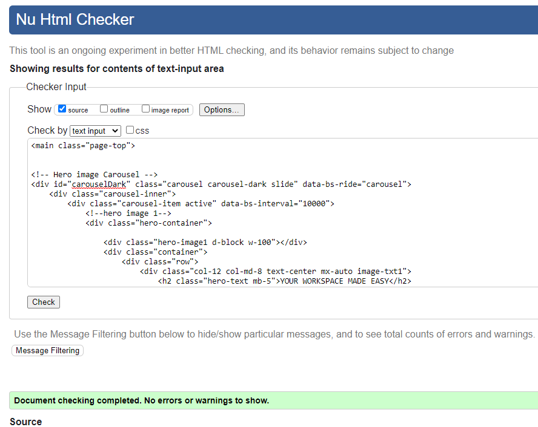

[<< Back to main ReadMe](README.md)

# DESK HQ - Testing

Visit the deployed site: [DESK HQ](https://desk-hq.herokuapp.com/)

---

## CONTENTS

  * [Manual Testing](#manual-testing)
    * [User Story Testing](#user-story-testing)
    * [Full Testing](#full-testing)
  * [Automated Testing](#automated-testing)
    * [Python Unit Tests](#python-unit-tests)
  * [Code Validation](#code-validation)
    * [W3C Validator](#w3c-validator)
    * [Javascript Validator](#javascript-validator)
    * [Python Validator](#python-validator)
    * [Lighthouse](#lighthouse)
  * [Bugs](#bugs)
    * [Solved Bugs](#solved-bugs)
    * [Known Bugs](#known-bugs)
- - -

## Manual Testing

* ### User Story Testing

| Expectations                                                                                 | How are they achieved?                                                                                                                                                                                                                                                                                                                                                                                                                          |
|----------------------------------------------------------------------------------------------|--------------------------------------------------------------------------------------------------------------------------------------------------------------------------------------------------------------------------------------------------------------------------------------------------------------------------------------------------------------------------------------------------------------------------------------|
| As a **first time user**                                                                   |                                                                                                                                                                                                                                                                                                                                                                                                                                      |
| I want to be able to access the website from any device. | The website is fully responsible and accessible on all screen sizes, starting at 360px.|
| I want to easily understand what the site is for.                           | The Home and the about page describes the goals of the site, and a Contact Form is included in case the user has any other questions.                       |
| I want to be able to easily navigate and find content.  | The navbar with a fixed top position is always present on the screen and allows for navigating the website from any point on the website.                      |
| I want to create account to make booking.                                                                     | The user can register a new account.                                                                                                                                                                 | I want to contact somebody via the contact form or contact details for enquiry.                    | The website provides a contact form.                                        |
| Quickly understand the benefits of co-working and how the space can help me grow my business, so that I am motivated to sign up.               | The description of the site on the home and about us page encourages new users to register for an account.                                                                                                                                                            |                     ||                                                                                                ||                                            |       | I want to learn more about the project on github. | A github link and a link to social media are available in the footer and accessible from every page. |
| I want to receive feedback from my intaraction with the website. | 1. Django messages inform the user about the status of their actions.  2. Error messages notify the user if something goes wrong. |
|  As a **Returning user**                                                                               |                                                                                |                                                              ||                            ||
| I want to Log in to my account.          | A login link is provided on the navbar.          ||
| I want to be able to easily make my workspace booking. | The book a space button is displayed prominently on the hero image of the home page. |
| I want to be able to Edit my workspace booking |  When a user views their booking on the space booking page, they are given the option to edit their booking.
| I want to be able to Delete my workspace booking. | When a user views their booking on the space booking page, they are given the option to delete their booking. When the user selects delete, a modal will pop up to confirm deletion, then redirected to confirmation page. |
| As an **Admin user**                |
| I want to be able to manage or approve booking contents. |The admin panel provides CRUD functionalities, which allows for the management and modification of user authentication, contents, users, groups, and permissions.   |

[<< Back to main ReadMe](README.md)
- - - 

* ### Full Testing

  The app was manually tested in the following browsers:

  * Chrome
  * Safari
  * Firefox
  * Edge
  * Opera

Full manual testing were performed on different devices and screen sizes, using [Media Gensis](https://responsivedesignchecker.com/) & [Browser Stack](https://www.browserstack.com/).

BrowserStack is a cloud-based web and mobile testing platform that provides testing on a variety of browsers, operating systems, and mobile devices. It allows running automated and manual tests on real devices and browsers, which helps to ensure that web applications are compatible with different browsers, operating systems, and devices.

Futher testing were done by friends and family on a variety of devices and screen sizes. 

| Feature | Expected Outcome | Testing Performed | Result | Pass/Fail |
| --- | --- | --- | --- | --- |
|Test responsiveness of website on all screen sizes, on and browsers | 1. Open website in browser: https://desk-hq.herokuapp.com/  2. Right click and inspect  3. Click the toggle device toolbar  4. Set the zoom  5. Click and drag the responsive window down to resize between 300px to 2900px, checking contents layout.  6. Repeat steps on all pages| Website is responsive, all elements contained, and images not distorted| Website is responsive, all elements contained, and images not distorted. | Pass |
| `Navbar` |
|  |  |  |  |  |
| DESK HQ Logo & Title | When clicked the user will be redirected to the home page. | Clicked Logo and title | Redirected to the home page. | Pass |
| Home Page Link | When clicked the user will be redirected to the home page.| Clicked link | Redirected to the home page. | Pass |
| About Us Page Link | When clicked the user will be redirected to the about us page. | Clicked link | Redirected to the about us page. | Pass | 
| Services Page Link | When clicked the user will be redirected to the services page. | Clicked link | Redirected to the services page | Pass | 
| Booking Details Page Link (Logged in users only) | When clicked the user will be redirected to the booking page. | Clicked link | Redirected to the booking page | Pass | 
| Sign Up Link (Only shown if user not in session) | When clicked the user will be redirected to the sign up in page. | Clicked link | Redirected to the sign up in page | Pass | 
| Log in Link (Only shown if user not in session) | When clicked the user will be redirected to the log in page. | Clicked link | Redirected to the log in page | Pass | 
| Log out Link (Logged in users only) | When clicked the user will be redirected to the home page and a flash message displayed to let the user know they have been logged out successfully. | Clicked link |Redirected to the home page and a flash message displayed to let me know I have been logged out | Pass | 
| `Footer` |
|  |  |  |  |  |
| DESK HQ Title | When clicked the user will be redirected to the home page. | Clicked title | Redirected to the home page. | Pass | 
| Copyright year | The copyright should display the correct year - this is a JavaScript function that checks what the current year is, and injects it into the footer | Checked the year | Displaying the correct year | Pass |
| `Home Page` |
|   |   |   |   |
| Book a space button on the hero image carousel| When clicked the user will be redirected to the space booking page. | Clicked button | Redirected to the space booking page | Pass | 
| Our Services button on the image card | When clicked the user will be redirected to the services page. | Clicked link | Redirected to services page | Pass | 
| Enquire Now button | When clicked the user remains on home page. Flash message informs user message received | Clicked button | User remains on home page | Pass | 
| `Log in Page` |
| Username input - empty | This is a required field so the form should not submit if empty | Tried to submit the form with this field empty | Tooltip tells me this field is required | Pass | 
| Password input empty | This is a required field so the form should not submit if empty | Tried to submit the form with this field empty | tooltip tells me this field is required |  Pass | 
| Log in button | Saves the user to session and redirects to home, or the booking page, if user tries to book without log in. Flash message is displayed to user as user’s name | Submitted form | Redirected to the home or the booking page, if user tries to book without log in first and flash message shown | Pass | 
| Incorrect username or password used | A message should display saying username/password incorrect - not letting user know which input is incorrect | Incorrect username and/or password entered | Message display to let the user know they have entered an incorrect username and/or password | Pass | 
| Link to Sign up page |  This should redirect the user to the sign up page | Clicked link | Redirected to the sign up page | Pass |
| `Sign Up Page` |
| | | | | | |
| Username input | The username should not include space| Entered username with space | tooltip lets the user know they have entered invalid username | Pass | 
| Username input - empty | The username is a required field, so should not submit with no value | Tried to submit form with no value entered | Tooltip lets user know this value is required | Pass | 
| Username input | If username is in use, message should displayed to user | username already exist | Message displayed username already in exist | Pass| 
| Email input | The email input should include an email address  | Entered plain text | Tooltip tells user to use an email address here | Pass | 
| Email input - empty | The email is a required field, so should not submit with no value | Tried to submit form with no value entered | Tooltip lets user know this value is required | Pass | 
| Password input | This field should contain at least 8 characters long | Entered password too short | Tooltip tells user the password should be at least 8 characters long | Pass | 
| Password input - empty | The password is a required field, so should not submit with no value | Tried to submit form with no value entered | Tooltip lets user know this value is required | Pass | 
| Sign up button | Should redirect user to home page and a log in successful message is displayed | Created new user and submitted form | Redirected to home page and a flash message is displayed | Pass |
| `About us Page` | 
|   |   |   |   |  | 
| About us Page | Validate navigation to the correct page from the navbar when clicked | Link navigate to about us page | Link navigate correctly | Pass | 
| Contact us button | When user clicks redirect user to the contact form on the home page  | Link navigate to contact form on home page | Element behaves as expected | Pass | 
| `Services Page` |
|   |   |   |   |  |
| Services Page | Validate navigation to the correct page from the navbar when clicked | Link navigate to services page | Link navigate correctly | Pass |
| `Space Booking Page` | 
| Book a workspace button ((Only accessible if user is logged in)) | User can make booking. Users choose from choice of drop down options in the space booking services. | Clicked button | Booking saved to database, and user is redirected to home page with a flash message | Pass |
| Location dropdown | This should be a choice field with the location address.  2. User should be able to select a location of their choice.  3. Selection saved saved | Clicked location address | Location saved to the database | Pass | 
| Space Booking dropdown | This should be a choice field with the space booking type.  2. User should be able to select a space booking of their choice.  3. Selection saved | Clicked space booking | space booking saved to the database | Pass | 
| Booking Date | This should be a date selection field with the calendar.  2. User should be able to select a date of their choice.  3. Selection saved | Clicked booking date | booking date saved to the database | Pass | 
| Booking Date Validation | This should be a date selection field with the calendar.  2. User cannot select a past date or same day.  3. User get an error message date cannot be in the past or the same day. Booking is not saved and redirects the user to the  space booking page and a flash error message to let the user know booking has not been successful. | Clicked booking date button | Booking is not saved to database and redirects the user to the space booking page and a flash error message to let the user know booking has not been successful | Pass | 
| Booking Duration dropdown | This should be a choice field with the booking duration.  2. User should be able to select a duration of their choice.  3. Selection saved | Clicked booking duration | booking duration saved to the database | Pass | 
| Booking Start dropdown | This should be a choice field with the booking start time.  2. User should be able to select a booking start of their choice.  3. Selection saved | Clicked booking start | booking start saved to the database | Pass | 
| Booking end dropdown | This should be a choice field with the booking end time.  2. User should be able to select a booking end of their choice.  3. Selection saved | Clicked booking end | booking end saved to the database | Pass | 
| `Booking Details Page` | 
|   |   |   |   |  | 
| Highlight Booking Details in the navbar (Only shown if user is logged in) | When the user clicks this link they should be taken to the booking details page to view their booking if any previously made. | Click button | Redirected to the booking details page | Pass | 
| Edit booking button | The user should be taken to the edit booking page with the selected space booking pre-populated in the input | Clicked button | Taken to the edit space booking page. Input pre-populated with the current booking field | Pass | 
| Delete button | When the user clicks the delete button a modal should pop up asking the user to confirm they wish to cancel the booking, user is redirected to a confirm delete page | Clicked button | Modal popped up and displayed the confirm deletion message | Pass | 
| Delete button on 'Deletion modal' | When the user clicks the delete button the user is redirected to a confirm delete page. A flash message will confirm deletion and the user is redirected to space booking page | Clicked button | Booking Details is deleted from the page and a flash message displayed success. Redirected to the booking details page | Pass | 
| Cancel button on deletion modal | When the user clicks the cancel button the modal should close | Clicked button | Modal closed | Pass | 
| `Error Page` | 
|   |   |   |   |   | 
| Home page link | Redirects the user to the home page | Clicked link | Redirected to home page | Pass | 
| `Pagination` | 
|   |   |   |   |   | 
| Pagination element | The element should navigate the booking details page.  2. Ensure the pagination block is present.  3. Ensure it works when clicked| The pagination block is present when needed | Element behaves as expected | Pass | 
| `Back to top button` | 
| Back to top button| This element should appear when user scroll down the page.  2. It should take user back to the top of the page when clicked.  3. It should be repeated across all pages.| Button appears when scrolled down and takes you back to the top of the page.| Button behaves as expected. | Pass | 
| `Django Messages work correctly` | 
| Flash/Display messages| Messages should be displayed at the top when user sign in.  2. User make booking/update/delete.  3. User logout | A message appears at the top and disappear after 3.5 seconds | Elements behave as expected | Pass | 
| `Hover color change on buttons` | 
| Hover over buttons | This button should change color when user hover on the buttons on the home page.  2. Hover over links and social icons in the footer.  3. Hover over the contact us on the about us page.  4. Hover over sign in and logout page and navigate to booking bookings page. | Button changed color when hovered over. | Elements behave as expected. | Pass |

[Back to the Top](#contents)

- - -

## Automated Testing

### Python Unit Tests

This project uses the [Django’s unit tests](https://docs.djangoproject.com/en/4.1/topics/testing/overview/).

* Django’s unit tests use a Python standard library module: unittest. This module defines tests using a class-based approach.

* The tests solely rely on database access such as creating or querying the models. Hence, the test were created using 'test classes' as subclasses of django.test.TestCase rather than unittest.TestCase. Leading to unit tests that pass when run in isolation but fail when run in a suite.

* It does not require any additional dependencies to run. 

 * `python3 manage.py test `

 * To see a coverage report use the command: ` coverage run --source='.' manage.py test `

 * `coverage report` : Specify the path to the file after the command to see a report on the particular file or group of files. 

 * `coverage html` 

* `Python3 –m http.server` : to view coverage 

The Testcases are not fully finished due to time constarint, but I intend to continue working on testing to allow me understand more about the Django’s unit tests. Please find the coverage report screenshots image below.

[Coverage Report](./READMEimages/coverage-report.png)

## Code Validation

### **W3C Validator**

**[W3C Markup Validation](https://validator.w3.org/) - HTML Validation**

All pages of the website were run through HTML Validator, via direct input and inspecting the page source.

**Home Page**

**About Us Page**

**Services Page**

**Space Booking Page**

**Booking Details Page**

**Update Booking Page**

**Delete Booking Page**

**No Booking Page**

**Sign Up Page**

**Sign In Page**

**Error Page**

**[W3C CSS Validation](https://jigsaw.w3.org/css-validator/) - CSS Validation**

The website CSS Stylesheet was ran through CSS Validator. No errors were detected

[Back to the Top](#contents)

- - -

### **Javascript Validator**

 **[JS Hint](https://jshint.com/) - JS Validation**

All JS files were run through JS Hint. One warning detected with google map. 

However `new` is used to access the markerClusterer with the CDN.

`const markerCluster = new markerClusterer.MarkerClusterer({ map, markers });`

### **Python Validator**

[CI Python Linter](https://pep8ci.herokuapp.com/) was use to validate the python files.

* [admin.py](./READMEimages/python-validation-admin.png) - No errors or warnings.

* [forms.py](./READMEimages/python-validation-forms.png) - No errors or warnings.

* [models.py](./READMEimages/python-validation-models.png) - No errors or warnings.

* [desk > urls.py](./READMEimages/python-validation-desk-urls.png) - No errors or warnings.

* [desk > views.py](./READMEimages/python-validation-desk-views.png) - No errors or warnings.

* [desk > test_models.py](./READMEimages/python-validation-test-models.png) - No errors or warnings.

* [desk > test_views.py](./READMEimages/python-validation-test-views.png) - No errors or warnings.

* [deskspace > urls.py](./READMEimages/python-validation-deskspace-urls.png) - No errors or warnings.

* [deskspace > views.py](./READMEimages/python-validation-deskspace-views.png) - No errors or warnings.

- - -

### **Lighthouse**

I used Lighthouse within the Chrome Developer Tools to test the performance, accessibility, best practices and SEO of the website.

**Home Page**

* [Home Page](./READMEimages/lighthouse-home-page.png)

**Home Page Mobile**

* [Home Page Mobile](./READMEimages/lighthouse-mobile-home-page.png)

**About Us Page**

* [About Us](./READMEimages/about-us-page-desktop-lighthouse.png)

**About Us Page Mobile**

* [About Us Mobile](./READMEimages/about-us-page-mobile-lighthouse.png)

**Services Page**

* [Services Page](./READMEimages/service-page-desktop-lighthouse.png)

**Services Page Mobile**

* [Services Page Mobile](./READMEimages/service-page-mobile-lighthouse.png)

**Sign Up Page**

* [Sign Up Page](./READMEimages/sign-up-page-desktop-lighthouse.png)

**Sign Up Page Mobile**

* [Sign Up Page Mobile](./READMEimages/sign-up-page-mobile-lighthouse.png)

**Sign In Page**

* [Sign In Page](./READMEimages/sign-in-page-desktop-lighthouse.png)

**Sign In Page Mobile**

* [Sign In Page Mobile](./READMEimages/sign-in-page-mobile-lighthouse.png)

**Space Booking Page**

* [Space Booking Page](./READMEimages/space-booking-page-desktop-lighthouse.png)

* [Space Booking Page Mobile](./READMEimages/space-booking-page-mobile-lighthouse.png)

**Booking Details Page**

* [Booking Details Page](./READMEimages/booking-details-page-desktop-lighthouse.png)

* [Booking Details Page Mobile](./READMEimages/booking-details-page-mobile-lighthouse.png)

**Update Booking Page**

* [Update Booking Page](./READMEimages/update-booking-page-desktop-lighthouse.png)

* [Update Booking Page Mobile](./READMEimages/update-booking-page-mobile-lighthouse.png)

- - -

## Bugs

**Solved Bugs** 

| No | Bug | How I solved the issue |
| :--- | :--- | :--- |
| 1 | After creating the Location Models and linking it with the Booking Models as it's ForiegnKey, I made a migration, an error "You are trying to add a non-nullable field <field> to <model> without a default; we can't do that (the database needs something to populate existing rows). Please select a fix:"  1. Provide a one-off default now (will be set on all existing rows with a null value for this column)  2. Quit, and let me add a default in models.py | An option '2', was selected from the given options, where I added a default placeholder to the location model. Then a different error popped up. `Value Error: Field 'id expected but got ''`. The was fixed by creating an 'id' with a `primary_key` value of `True` for location models. |
| 2 | When the Services page template was created, I did not make it dynamic and also did not add the content to the admin panel right after creating the template, causing a `Programming Error at desk_service`. Where only the Sqlite (local host) has the template view, while the  postgreSQL database(ElephantSQL) was unable to find the content. | I use the `dumpdata command` to input the content into the postgreSQL database(ElephantSQL), then reran migration: `python3 manage.py dumpdata app.modelsName > modelsName.json` The dumpdata command can be used to generate input for loaddata (https://docs.djangoproject.com/en/4.2/ref/django-admin/#dumpdata). |
| 3 | A TemplateSyntax Error at /Service/.  . Using the for loop Django syntax wrongly to loop through the services page images and content dynamically. | Django doesn't accept a `modulo` operator. The `divisibleby` fixed the error - . |
| 4 | Bootstrap Flash messages error from Javascript. `Cannot read properties of null (reading 'defaultPrevented')` . | When I inspected the error message from inside the Chrome DevTools console, a suggestion pointing to use Jquery was found. I included a Jquery script link and the alert class: `$('.alert').delay(3500).fadeOut(1000);` to fix the bug. |

**Known Bugs** 

| Bug | Known Bug |
| :--- | :--- |
| Known bugs. | No known bugs as of present. |

[Back to the Top](#contents)

---

[<< Back to main ReadMe](README.md)
